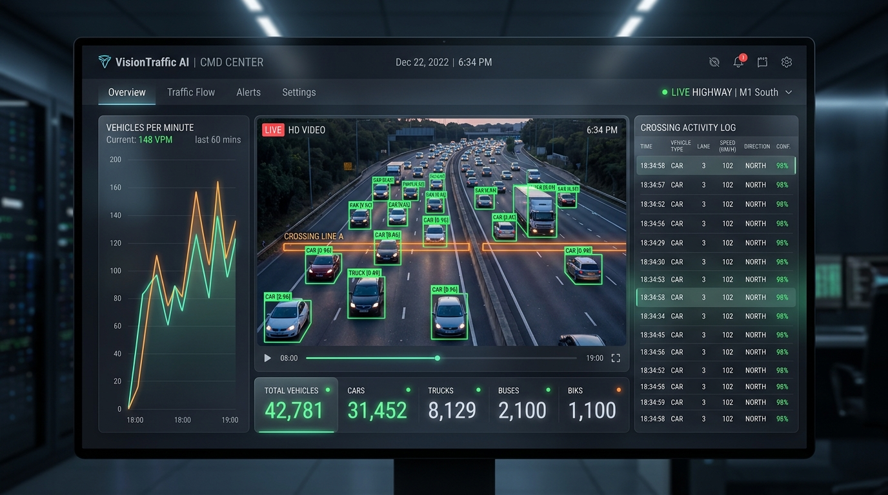

# VisionTraffic AI - Live Vehicle Monitoring & Traffic Analytics Dashboard

A modern, responsive, high-performance web frontend dashboard and backend pipeline for real-time vehicle detection and traffic analytics, built on an OpenCV computer vision pipeline.



---

## 🌟 Key Features

### 1. 🖥️ Command Center Video Player
- **Live Stream**: Streams processed OpenCV video via MJPEG (`/video_feed`) with real-time bounding boxes and centroid tracking.
- **Overlay Toggles**:
  - 🟢 **Bounding Boxes**: Green detection bounding boxes with vehicle classification (`Sedan`, `SUV`, `Truck`, `Two-Wheeler`) and size tags `(w × h)`.
  - 🔴 **Center Points**: Red centroid tracking dots with crosshair markers.
  - 🟠 **Counting Line**: Interactive reference counting line with visual flash upon vehicle crossing.
  - 🔬 **MOG2 Mask PiP**: Floating Picture-in-Picture window showing the morphological dilated background subtractor mask.
- **Player Controls**: Play, Pause, Speed Control (`0.5x`, `1.0x`, `1.5x`, `2.0x`), Loop restart, Crossing Audio Alert chime, Fullscreen mode, and Instant Frame Snapshot capture.

### 2. 📊 Live Metrics & Telemetry
- **Total Vehicle Counter**: Large digital counter with glowing increment animations.
- **Traffic Flow Rate**: Real-time Vehicles Per Minute (**VPM**) and projected Vehicles Per Hour (**VPH**).
- **Traffic Density Index**: Dynamic `Low`, `Moderate`, and `Heavy Congestion` status with color-coded progress meter.
- **Detection Sensitivity Meter**: Active threshold monitor based on minimum bounding box area (`80 × 80 px` = 6,400 px²).
- **Real-Time Stream Stats**: Live FPS, Stream Resolution (`1280 × 720`), and Server Latency (ms).

### 3. ⚙️ Interactive Parameter Control Panel
- **Counting Line Y-Position**: Real-time slider and number input (`50 - 1000 px`), quick-preset buttons (`250`, `400`, `550`, `650`), plus an interactive **"Pick on Screen"** crosshair tool to click anywhere on the video and set the line.
- **Minimum Vehicle Width & Height (`min_width_react`, `min_hieght_react`)**: Dynamic adjustment to filter out background noise or focus on specific vehicle sizes.
- **Line Tolerance Buffer (`offset`)**: Configurable pixel tolerance for vehicle crossing detection.
- **MOG2 Background Subtractor Settings**: History frames length (`100 - 1000`), Variance Threshold (`4 - 64`), and Shadow Suppression toggle.
- **Preset Profiles**: One-click presets for *Highway Fast Flow*, *Urban Dense Traffic*, *Night Vision / Low Light*, and *High Sensitivity*.
- **Sync & Reset**: Instant bi-directional sync with the running OpenCV backend and counter reset.

### 4. 📈 Analytics & Activity Log
- **Traffic Over Time Chart**: Interactive Area & Line Chart (powered by Chart.js) with neon gradient fills and dual Y-axes for cumulative volume and rolling flow rate.
- **Vehicle Classification Donut Chart**: Real-time breakdown of detected vehicles into Sedans/Cars, SUVs/Vans, Trucks/Buses, and Two-Wheelers.
- **Crossing Activity Log Table**: Complete timestamped event log with vehicle dimensions, direction, confidence score, and crossing coordinates.
- **Export Options**: Instant export of logs to **CSV** and **JSON** formats.

---

## 🚀 Quick Start Guide

### Option 1: One-Click Run (Windows)
Double-click `run_dashboard.bat`. This starts the Python streaming server and automatically launches your browser at `http://localhost:5000`.

### Option 2: Run via Terminal
```bash
# 1. Start the Python Flask OpenCV server
python app.py

# 2. Open in your browser:
http://localhost:5000
```

### Option 3: Standalone Browser Mode (Zero Backend Dependency)
You can directly open `index.html` in any modern web browser (Google Chrome, Edge, Brave, Firefox). The built-in client-side computer vision engine will play `video.mp4` and run real-time tracking, counting, and analytics right in your browser!

---

## 🛠️ Tech Stack & Architecture

- **Frontend**: HTML5, Vanilla JavaScript (ES6+), CSS3 with Glassmorphism, Tailwind CSS, FontAwesome 6, Chart.js 4.4, Web Audio API.
- **Backend**: Python 3, Flask, Flask-CORS, OpenCV (`cv2`), NumPy, Threaded MJPEG Video Streaming.
- **Computer Vision Algorithm**:
  1. Grayscale conversion & Gaussian blur (`3 × 3`, `σ = 5`).
  2. MOG2 Background Subtraction (`history = 500`, `varThreshold = 16`).
  3. Morphological dilation & closing with elliptical structuring element (`5 × 5`).
  4. Contour extraction & bounding rectangle filtering (`w ≥ min_width`, `h ≥ min_height`).
  5. Centroid tracking and line crossing verification within `[line_y - offset, line_y + offset]`.

---

## 📡 REST API Endpoints

| Endpoint | Method | Description |
| :--- | :--- | :--- |
| `/` | `GET` | Serves the web dashboard frontend |
| `/video_feed` | `GET` | MJPEG video stream with live OpenCV annotations |
| `/mask_feed` | `GET` | MJPEG stream of the MOG2 background subtractor mask |
| `/api/stats` | `GET` | JSON telemetry (counter, FPS, VPM, density, detections, recent crossings) |
| `/api/config` | `POST` | Real-time update of line position, min width/height, offset, subtractor params |
| `/api/reset` | `POST` | Reset cumulative vehicle counter and crossing logs to 0 |
| `/api/control` | `POST` | Stream playback controls (`play`, `pause`, `restart`) |
| `/api/logs` | `GET` | Full crossing event logs in JSON format |

---

## 📂 Project Structure

```
vehicle counting system/
├── app.py                      # Flask OpenCV Streaming & REST API Server
├── index.html                  # Main Web Dashboard Frontend
├── video.mp4                   # Highway traffic source video
├── vehicle counting system.py  # Original OpenCV script
├── run_dashboard.bat           # 1-Click Windows Launcher
├── static/
│   ├── css/
│   │   └── dashboard.css       # Glassmorphism design system & styles
│   └── js/
│       └── dashboard.js        # Dashboard state & vision engine controller
└── README.md                   # Documentation
```
